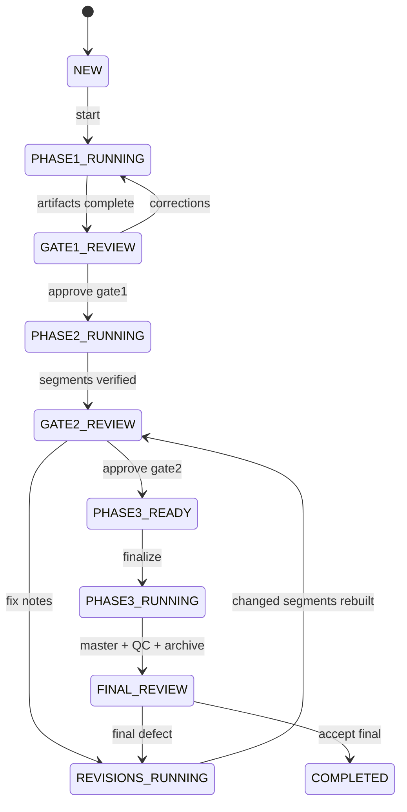

# Спецификация продукта Local AI Video Factory

## Результат продукта

Пользователь кладет пронумерованные исходники в проект, запускает один оркестратор и получает:

1. текстово утвержденный монтажный план;
2. проверенные по отдельности first-pass сегменты;
3. исправленный master и publishing package;
4. сохраненные reusable assets и воспроизводимый журнал решений.

Продукт не считается работающим, если он умеет только выполнить отдельные FFmpeg-команды или собрать preview.

## Принципы

- **Transcript-first:** управление монтажом происходит в Markdown.
- **Segment-first:** длинный ролик собирается из независимо проверяемых сегментов.
- **Two explicit gates:** тяжелая работа не начинается без осмысленного approval.
- **Rendered truth:** проверяется реальный render, а не только исходный план.
- **Recoverable:** прерванный этап продолжается по state/checkpoint без запуска с нуля.
- **Safe cleanup:** оригинал и master не удаляются до подтвержденного архива.
- **Learning loop:** повторяемое замечание становится правилом style/QC.

## Пользовательский интерфейс v1

```powershell
python pipeline/studio.py start projects/my-video
python pipeline/studio.py status projects/my-video
python pipeline/studio.py approve projects/my-video gate1
python pipeline/studio.py revise projects/my-video
python pipeline/studio.py approve projects/my-video gate2
python pipeline/studio.py finalize projects/my-video
python pipeline/studio.py resume projects/my-video
python pipeline/studio.py accept-final projects/my-video
```

Низкоуровневые `scan`, `transcribe`, `build-segment`, `captions` и подобные команды остаются диагностическими адаптерами. Пользователь не должен сам составлять из них pipeline.

## Состояния



Каждый running-state может перейти в `FAILED_RECOVERABLE`. `resume` продолжает с последнего валидного checkpoint.

## Запреты оркестратора

- gate нельзя пройти по одному факту существования файла: нужен approval с hashes;
- полный master нельзя собирать до Gate 2;
- сегмент нельзя считать проверенным без повторной транскрибации rendered media;
- warning нельзя скрывать в логе: он попадает в human-facing review;
- raw/work нельзя чистить без проверенного архива;
- нельзя просить абстрактное «дай замечания по темпу» вместо gate checklist.

## Не входит в v1

- облачный multi-user SaaS и собственное облачное хранилище;
- автоматическая публикация;
- обязательность DaVinci Resolve;
- обучение ML-модели на пользовательских данных.

Это может подключаться позже через адаптеры без изменения трехфазного контракта.
